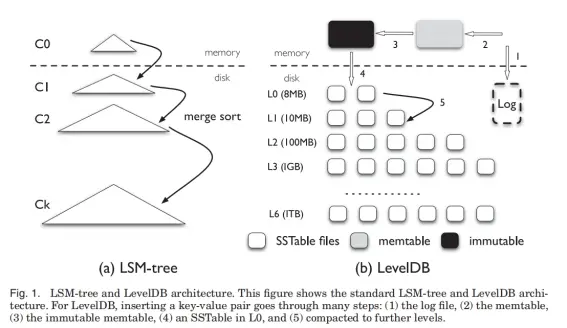
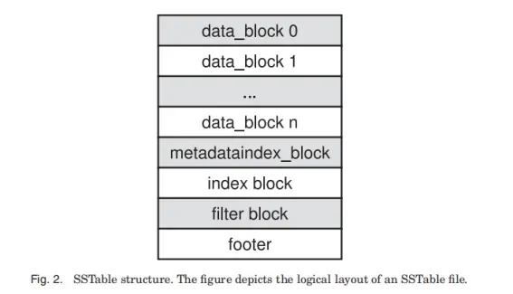
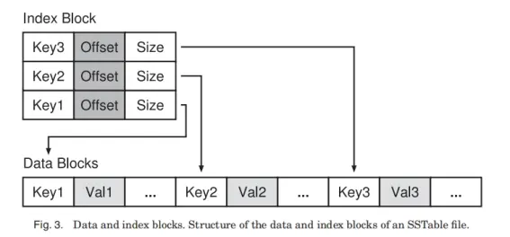
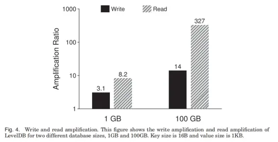
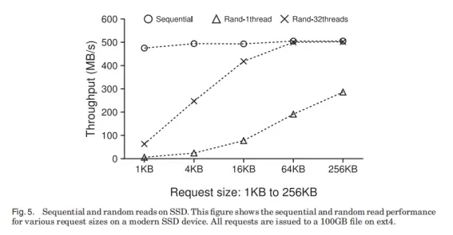
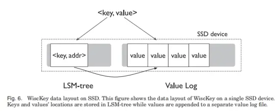
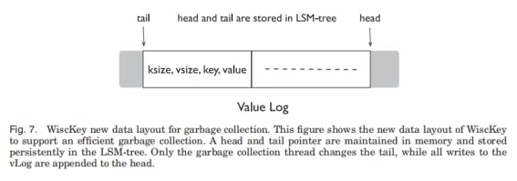

# WiscKey: 在 SSD 感知存储中将键与值分离

## 摘要
我们提出了Wisckey,一种基于 LSM Tree 的持久键值存储，具有面向性能的数据分布，其将键与值分离，以最小化读写放大。Wisckey的设计是为固态硬盘高度优化的，其利用了固态硬盘的顺序和随机性能特征。我们通过微基准测试和 YCSB 工作负载展示了 WiscKey 的优势。Microbenchmark 结果显示，在加载数据库方面，WiscKey 比 LevelDB 快2.5到111倍，且具有明显更好的尾部延迟，在随机查找方面快1.6到14倍。在所有六个 YCSB 工作负载中，WiscKey 都比 LevelDB 和 RocksDB 快。
## 1. 介绍
当前 key-value 的数据库应用广泛，如谷歌的 levelDB，Facebook 的 RocksDB。 
他们都应用了一个数据结构，LSM-Tree（Log Structured Merge Tree），使他们代表了目前最好水平。 
先来介绍一个不同的数据结构——B-Tree。B树可以理解为二叉平衡树的多叉版本，每一次更新可能需要平衡，带来多次随机查找，因此不适合固态或机械硬盘。 
再来介绍一下LSM树。LSM树将多个键值对合并，保存一定量后，顺序写入到磁盘中。后台为了加速查询，则不断的排序，将键值对从磁盘里读取，排序，再写入，因此会带来50倍以上的读写放大。 
当下的LSM不适合固态硬盘 SSDs（Solid-state Storage Devices）。如果用固态硬盘来替换机械硬盘，虽然性能提升了，但是会降低90%的吞吐，增加10倍以上的写负载，导致其性能无法充分发挥，原因如下： 

1. 固态硬盘的连续读写速度和随机读写速度没有机械硬盘那么差别大。因此 LSM 优化的批量连续写入可能会不必要的浪费带宽。 
2. 固态硬盘有很大程度的内部并行性，LSM 需要小心设计以驾驭其并行性 
3. 固态硬盘重复写入会导致设备损耗，LSM 带来的写放大会加速设备老化 
WiscKey 优化了 LSM 树，将键值对储存分离，也就是排序和垃圾回收这两个过程分开。这样能够减少排序时不必要的值移动，进而减小读写放大的倍数。此外这样还能减少 LSM 树大小，减少读次数的同时，在查询时有更好的缓存。 
但是也带来了一些挑战，他这样解决： 

1. 范围查询（scan）。由于后台值不是排序的，范围查询会很慢。——用固态硬盘s内部并行性解决。 
2. 需要垃圾回收来清理过期的值。——提出了一个只涉及顺序IO，对前台影响小的垃圾回收器。 
3. 分离键和值会导致崩溃一致性的挑战——利用了一个文件系统的特性，在崩溃时追加不会增加垃圾。 

最后测算并比较了 WiscKey 的性能。发现其在大部分真实场景都比 LevelDB好，小部分场景不好，如随机写入很多小值，并执行大量顺序的范围查询下。在 YCSB 基准下，比 LevelDB 和 RocksDB 都要好。 
## 2. 研究背景与意义

### 2.1. 日志结构合并树

LSM 树是一个写，删除频繁的场景下，提供了有效索引的持续化结构。在写入时，会延迟等待数据打包后，一次性顺序写入磁盘。 

### 2.2. LevelDB
LevelDB是一个广泛使用的键值存储，它基于 LSM 树，灵感来自于 BigTable。LevelDB 支持范围查询、快照和其他在现代应用程序中有用的特性。在本节中，我们将简要描述LevelDB的核心设计。

LevelDB 接口是一个基本的键值存储 API，其具有一些更丰富的函数，包括创建批处理、快照和迭代器的方法。主要的方法有Put()、Delete()、Get()、Write()、NewIterator()、GetSnapshot() 和 CompactRange()。Write() 操作用于将多个写入操作一起批处理；Put() 和 Delete() 操作在内部实现为批处理写入。快照用于保存不同键值的以前版本。在每次写操作中，都会生成一个序列数；对于早期的不活跃的快照的垃圾回收过程只发生在压缩期间。压缩只保留部分键值对，这些键值对的序号 ≥ 最老的活快照（即，由 GetSnapshot 标记但尚未释放的快照）。

范围查询是通过基于迭代器的接口实现的，使用 Next() 和 Prev() 方法进行扫描，使用Seek()、SeekToFirst() 和 SeekToLast() 方法跳转到特定的键。CompactRange() 操作使用户能够在自动压缩(稍后讨论)开始之前触发压缩

LevelDB 的架构如图1（b）所示，LevelDB 在内存有2个 skiplists，即 memtable 和 immutable memtable，在磁盘有2个log、属于7个等级的若干 SSTable 文件（Sorted String Table file）。

那么 SStable 文件是如何组织的呢？ 

如图2所示，每个文件由许多块构成。每个块由三元对 <块数据，类型，CRC循环冗余验证码> 构成。类型指的是数据的压缩状态。下面按照图2顺序依次介绍各个块内容：

1. data_block：每16个键值对采用前缀压缩方法储存，即不保留各个键拥有的相同前缀，只保留各自不同的后缀，每16个键值对最后有一个重设点（ restart point），储存了原始键值。每个块最后有一堆偏移量（offset），指向各个 restart point，方便二分寻找。

2. matadataindex_block：保存一个指向 filter 块的指针。

3. index_block：如图3所示，以三元对构成，key指向每个块第一个key位置。

4. Filter block：采用 Bloom fifilter，快速判断一个文件有没有某个键，避免多余的二分查询。

5. footer：保存两个指针，指向 matadata 以及 index 两个块。

每当一个键值对写入前，其采用 WAL（write ahead log）的策略，需要先写 log 中，防止 crash 数据丢失。然后会将键值对写入一个内存表（memtable）中。当内存表满了后，就变为只读内存表（immutable memtable），LevelDB 便切换使用另一对新的log、内存表继续储存后续用户插入的键值对。而这个只读内存表会被一个压缩线程将数据写入磁盘，在L0级生成一个大约2MB的 SSTable 文件，然后对应 log 数据便会丢弃。

从L1开始，每增加一个级别，该层的总大小上限便翻十倍。当某层文件总大小超过该层的上限之后，压缩线程便会在该层选择一个文件，与下一层的所有键重叠的文件进行归并排序，然后在下一层生成合并后文件。由于L0的文件都是直接从内存写入的，因此不同文件之间键可能会重叠。而其他层，LevelDB 保证每层各个文件键不重叠。

### 2.3. 读写放大
LevelDB 以及其他基于 LSM 设计的数据库一个很大的问题就是读写放大。

先来说写放大。写入数据可能会导致压缩，需要读取下一层键覆盖的文件。最坏情况下需要读取下一层所有文件，再考虑不同层大小差距是十倍，那么则是十倍的写放大。如果考虑大数据集下，任何新产生文件都会从L0转移到L6，那么写放大会达到50倍以上。 

再来说读放大。读放大有两个来源：

1. 如果忽略查询内存里面的memtable、immutable memtable 的时间，对于磁盘上，最多需要查询L0的8个文件，L1-L6每层各1个文件，即14个文件。

2. 对每个文件查询，需要查询很多块，也带来了放大。

举例而言，为了查找1KB的键值对，LevelDB需要读取16KB的索引块，一个4KB的 Bloom 过滤器块，和一个4KB的数据块，总共24KB。在最坏情况下，如果要查询14个 SSTable 文件，那么 LevelDB 的读放大是24×14=336。较小的键值对将导致偶数更高的读放大。

为了测算 LevelDB 的实际读写放大，我们装载了一个全是 1KB 大小的键值对的数据库，并执行了10万次查询。对于1GB、100GB的两个 LevelDB 数据库而言，实验测得的读写放大倍数如下图4所示： 

对于写放大，如果数据越多，迁移层数越多写放大自然提高。不过这里并没有达到50倍的估算，可能是因为每一次压缩并不会将下层所有数据都读取出来合并，也便不会有10倍的放大。

对于读放大，数据小时，索引块，Bloom 块都能被缓存到内存中，当数据大时，每次查询都需要查询不同的SStable 文件，因此便需要重新读取索引、Bloom 块，也就达到了预测的读放大倍数。

需要注意读写放大是对硬盘性能的一种合理权衡。举例来说，对于一个寻道时间在10ms，读写速度在100MB/s 的机械硬盘来说，读取1KB的随机数据需要10ms，顺序读写下一数据块的时间为10us——随机和顺序之间相差1000倍。对比采用需要随机存取的B树，使用顺序读写的 LSM 结构只要读写放大小于1000倍便能有更快的性能表现。另一方面，LSM 的读放大仍然可以与b树相媲美。例如，考虑一个高度为5、块大小为4KB的B树，一个1KB键值对的随机查找将需要访问6个块，从而导致读放大为24。

### 2.4. 闪存硬件
许多现代服务器都采用固态硬盘设备来实现高性能。由于固态硬盘独特的擦除-写循环和昂贵的垃圾回收机制，固态硬盘中的随机写与机械硬盘类似，都被认为是有害的。因此，避免随机写操作的 LSM 树非常适合 固态硬盘；许多固态硬盘优化的键值存储都是基于 LSM-trees 的。

但是，相比于机械硬盘，固态硬盘的随机读写和连续读写性能差距并没有那么大。特别的，在某些场景下，固态硬盘的随机读写性能可以媲美连续读写。如下图5所示 

此外，对于更高端的固态硬盘，并发随机读和顺序读之间的差距要小得多

对于机械硬盘来说，LSM 带来的读写放大是可以接受的。但是对于固态硬盘而言，LSM 会带来不必要的额外的读写从而浪费带宽。本文目的就是改善 LSM 在固态硬盘上的表现，以充分利用固态硬盘的带宽。 

##  3. WISCKEY
如上所述，LSM 的读写放大对于固态硬盘不太适合。接下来提出一种为固态硬盘优化的，减少读写放大的键值对数据库——WiscKey。 
WiscKey 有以下四大关键想法： 
1. Key Value 分离，将键放在 LSM 树里面，Value 放在分离开的  Value log 里面。 
2. 为了加速对乱序 Value 的查询，利用了固态硬盘的并行随机读特点。 
3. 使用独有的崩溃一致性和垃圾回收技术来有效地管理 Value log。 
4. 通过在不牺牲一致性的情况下删除 LSM 树日志来优化性能，从而减少了小型写操作带来的系统调用开销。 

### 3.1. 设计目标
WiscKey 是一个从 LevelDB 派生出来的单机持久化键值存储。它可以被部署为关系型数据库（例如MySQL）或分布式键值存储（例如MongoDB）的存储引擎。它提供了与 LevelDB 相同的API，包括Put(key, value)、Get(key)、Delete(key) 和 Scan(start, end)。其的设计遵循这些主要目标：

1. 低写放大：写放大会引入额外的不必要的写。虽然固态硬盘的带宽比机械硬盘高，但较大的写放大会消耗大部分的写带宽（超过90%的情况并不少见），并且由于擦除周期有限，固态硬盘的生命周期会减少。因此，最小化写放大以提高性能和器件寿命是很重要的

2. 低读放大：读放大过大会导致两个问题。首先，通过对每个查找执行多个读取操作，大大降低了查找的吞吐量。其次，加载到内存中的大量数据降低了缓存的效率。WiscKey  的目标则是通过小的读放大来加速查找。

3. 固态硬盘优化：通过匹配固态硬盘的性能特征，对固态硬盘进行了优化。具体来说，采用顺序写和并行随机读，以便应用程序能够充分利用设备带宽。

4. 丰富的 API：WiscKey 的目标是支持那些使 LSM 树流行的特性，如范围查询和快照。范围查询允许扫描连续的键值对序列。快照允许在特定时间捕获数据库的状态，然后对状态执行查找。

5. 更接近现实场景的键大小：在现代的负载场景中，键大小一般会很小，而值的大小则会相差很大。 WiscKey 的目标则是为这种实际的键值大小集提供高性能。 

### 3.2. 键值对分离
LSM 树最大开销就是不断排序的压缩环节。压缩时，许多文件会被读取到内存中，排序，然后写回磁盘，不断的压缩会影响前台的性能。但是排序这个过程又不能省。每一层中值的排序好，能使得范围查询大多数情况，读取连续的若干文件，单点查询每层最多需要读一个文件。

WiscKey 收到一个简单的事实启发。压缩排序的时候，只用排序键，而不用排序值。因为一般来说，键比值小得多，那么压缩时值排序键将会大大减少排序的数据。在 WiscKey 中，与键一起在 LSM 树中存放的只有值的位置，而值被放在其他对固态硬盘更友好的地方。这样能大大减小 LSM 树大小，进而显著地减小写放大。举例来说，假设一个16B的键，一个1KB的值，键在 LSM 树中的写放大值为10，值的写放大为1，那么总体写放大为 (10 × 16 + 1024)/(16 + 1024)=1.14。写放大的降低，同时也能减少固态硬盘的擦写周期，进而延长固态硬盘寿命。

WiscKey 更小的读放大能提高查找性能。查找时，其先去 LSM 树中查找键，然后再去查找值。可能你会认为两次查找会比 LevelDB 更慢。实际上，由于 WiscKey 的 LSM 树更小，因此查询键时将会查找更少的层数；此外，LSM 树很大一部分可以缓存在内存中。这样，每次查询只需要对值的一次随机读取，因此比 LevelDB 更快。举例而言，假设16B键和1KB值，如果整个键值数据集的大小是100GB，那么 LSM 树的大小大约是2GB(假设值的位置和大小的代价是12B)，这2G很容易便能缓存在现代系统的主内存中。

WiscKey 的架构如下图6所示，键即值的地址放在 LSM 树中，而值放在value-log 文件中，称其为 vLog。 

当用户插入一个键值对时，首先值会被附加在Vlog后，然后键以及值的地址以 <vLog-offset, value-size> 的二元对的形式被插入 LSM 树中。删除键时，只需要简单的将键从 LSM 树中移除，不需要修改vLog。所有在vLog里面有对应键在 LSM 树里面的都是有效值，没有对应键的则为无效值，会被垃圾回收，在3.3.2节讨论。

当用户查询键时，不论是单点查询还是范围查询，都会先去 LSM 中查询，如果找到了键则能获得对应值的地址，然后再根据地址从vLog中获取对应值。 
### 3.3. 挑战
虽然键值分离很容易想到，但是也带来了很多挑战和优化空间。比如，键值分离导致范围查询需要随机读写。此外，分离将会带来垃圾回收和崩溃一致性的挑战。下面来介绍我们如何应对这些挑战。 
#### 3.3.1 并行范围查询 
现代键值储存中，范围查找（扫描）十分重要。它能允许用户查找一个范围的键值对。许多系统适用键值储存作为他们的储存引擎，而范围查找则是他们的核心调用的API。

如前所述，对于范围查询，LevelDB为用户提供了一个基于迭代器的接口，包括Seek()、Next()、Prev()、Key()和Value()操作。要扫描一系列的键值对，用户可以先用Seek()查找起始键，然后调用Next()或Prev()逐个搜索键。要检索当前迭代器位置的键或值，用户分别调用key()或value()。

在LevelDB中，由于键和值放在一起进行排序，范围查询时便可以从 SSTable 文件中顺序读取所查询的键值对。然而，由于键和值在 WiscKey 中是分开存储的，范围查询需要随机读取，因此效率不高。正如我们在前面的图5中所看到的，固态硬盘上单个线程的随机读性能低于顺序读性能。然而，具有相当大请求大小的并行随机读可以充分利用固态硬盘内部并行性，获得与顺序读相当的性能。

因此，为了提高范围查询的效率，WiscKey 利用固态硬盘的并行I/O特性，在范围查询期间从vLog中预取值。其基本思想是，对于固态硬盘的有效检索，只有键需要给予特别的注意。只要有效地检索键，范围查询就可以使用并行随机读取来有效地检索值。

预取框架可以很容易地适应当前的范围查询接口。在当前接口中，如果用户请求范围查询，则向用户返回一个迭代器。对于迭代器上请求的每个Next()或Prev()， WiscKey 跟踪范围查询的访问模式。一旦请求连续的键值对序列，WiscKey 开始从 LSM 树中顺序地读取许多后续键。从 LSM 树检索到的相应值的地址被插入到队列中；多个线程同时从vLog中读取这些值。

#### 3.3.2 垃圾回收
基于 LSM 树的键值储存并不会立即删除更改或覆盖的键值对。相反地，只有在压缩时，如果和删除或覆盖的键值对相关的数据被找到了，这些数据才会丢弃，空间才会被回收。而 WiscKey 并不会压缩值，所以需要一个垃圾回收机制来回收在 vLog 中的空闲空间。

由于 vLog 里面只存放了值，因此一种简单的办法就是扫描 LSM 树，找到所有有效值，然后将 vLog 中没有 LSM 对应键的值给回收。但是这样开销过大，且只适用于离线的垃圾回收。

WiscKey 的目标是实现一个轻量的在线垃圾回收器。为了达到目标，我们不但在 vLog 中储存值，还储存了值的键的位置。新的数据布局如图7所示，以 <key size, value size, key, value> 的形式储存在 vLog 中。

WiscKey 的垃圾回收机制旨在保持有效值在 vLog 中连续存放。一头称为 head，新的值会在这里附加。另一头称为 tail，是任何时候启动垃圾回收时的起点。只有在头和尾之间的 vLog 部分包含有效值，并将在查找期间被访问。

垃圾回收时，WiscKey 会从尾部读取一个键值对块，比如几MB，然后在 LSM 中寻找哪些值是没有被删除或覆盖的有效值。然后 WiscKey 将有效值附加在 vLog 的头。最后释放尾部刚刚读取的键值对块，然后更新对应的尾部。

为了防止垃圾回收时崩溃而导致的数据丢失，WiscKey 必须要保证在实际释放空间之前，新添加的有效值和新的尾部将在设备上保持一致。WiscKey 为了做到这点用了以下步骤：在 vLog 附加有效值后，垃圾回收在 vLog 上调用 fsync()。然后它将这些新的值的地址，以及当前尾部，以同步的方式保存在 LSM 树中。尾部以<tail-marker, tail-vLog-offset> 的形式保存。最后 vLog 中的空闲空间才被回收。

WiscKey 可以配置为周期地启动垃圾回收，或者达到阈值后启动。垃圾回收也可以为了维护而离线运行。在很少删除的环境，或者储存过剩的环境下，垃圾回收会很少被触发。 

#### 3.3.3 崩溃恢复

在系统崩溃时，LSM 树实现通常保证插入键值对的原子性和插入对的顺序恢复。因为在WiscKey 架构中，值的储存是与 LSM 分离的，因此要想获得和 LSM 一样的崩溃保证显得很复杂。然而，WiscKey 通过使用现代文件系统（如 ext4、btrfs 和 xfs）的有趣属性提供了相同的崩溃保证。考虑一个文件，里面有序列 ，用户附加了序列 。那么当崩溃发生，现代文件系统恢复后，文件序列将会是 。也就是只有用户附加的某些前缀会被附加到文件。并不会有随机的字节或者不是前缀的字节被附加到文件后面。又因为值是被顺序附加到 vLog 里面，所以前述性质可以被翻译如下：如果崩溃后，vlog 中的值 X 丢失了，那么所有在 X后续插入的值都会丢失。

这里 vLog 保证每次崩溃只附加前缀数据，那么 LSM 怎么保证只附加了对应值的键呢？会不会出现 vLog 附加的数据对不上 LSM 插入的键呢？

译者这样理解：如3.2 节所述，插入键值对时，先附加 vLog，然后拿到了值地址之后，再将键与值地址二元对插入 LSM 树种。因此，当我插入了一堆键值对，然后突然掉电崩溃了，vLog会只附加了一部分值。这部分附加的键一定满足一定先插入了 LSM 中的。

当用户查询一个键值对时，如果因为键在系统崩溃时丢失而导致在 LSM 找不到键，那么 Wisckey 表现的就像传统的 LSM 树一样：即使值在崩溃前已经被写入了 vLog，那么值也会在后续被垃圾回收【因为找不到对应的键】。如果找到了对应的键，那么需要多做一步来保证一致性。此时，Wisckey 验证从 LSM 获取的值地址是否在当前 vLog 的有效范围内，其次验证是否找到的值对应键。如果验证失败，则认为值在系统崩溃时丢失，在 LSM 中删除键，并通知用户该键不存在。因为每个加入 vLog 的值都有个头文件，里面包含了其对应的键。如果需要的话，一个幻数（magic number）或校验和可以很容易地添加到头部。

译者理解这里的验证是一个双向验证的过程。首先找到键后，键旁边有值地址，可以验证地址是否合法。从地址取到值后，值的旁边有键，可以验证值旁边存的键是不是所查询的键。

为了防止崩溃时数据不完整，可以添加一个固定数字，即 magic number，幻数来校验是否数据被修改，或者直接对值算一个校验和，放到键，值的头文件里面，然后验证校验和是否相等来判断是否被崩溃影响。

### 3.4. 优化
键值分离提供了一个重新思考的机会，即 vLog 如何更新？LSM log 是否有存在的必要性？ 

#### 3.4.1. Value-Log 写缓冲
对每个 Put() 操作，Wisckey 需要调用 write() 系统调用，将值附加到 vLog中。在插入频繁的负载下，向文件系统发出大量的小容量写请求可能会带来明显的开销，特别是在快速的储存设备上。下图8显示了 ext4 (Linux 3.14) 中连续写入10GB文件的总时间。对于较小的写操作，每个系统调用的开销会显著增加，导致运行时间很长。而对于较大的写操作(大于4KB)，设备吞吐量则得到充分利用。

为了减少开销，Wisckey 会在用户空间缓冲区中缓冲值，并且只在缓冲区大小超过阈值或用户请求同步插入时才刷新缓冲区。因此，Wisckey 只发出较大的写请求，并以此减少 write()系统调用的次数。对于查找，wiskkey首先搜索 vLog 缓冲区，如果没有找到，则 vLog 中读取。显然，这种机制可能会导致在崩溃期间丢失一些缓冲区的数据。其保证崩溃一致性的实现类似于LevelDB。

#### 3.4.2. 优化日志结构合并树中的日志 
如图1所示，日志文件通常用于 LSM 树。LSM 树在日志文件中跟踪插入的键值对，这样，如果用户请求同步插入时出现崩溃，则可以在重启后扫描日志，并恢复插入的键值对。

在 Wisckey 中, LSM-tree 只用于保存键和值地址。此外，vLog 还记录插入的键以支持前面描述的垃圾收集。因此，在保证正确的情况下，可以避免写入 LSM-tree 日志文件。

如果在发生崩溃前，键还没有在 LSM 树中持久化，那么可以通过扫描 vLog 来恢复它们。然而，最简单的算法需要扫描整个 vLog 来进行恢复。为了减少扫描所需的数量，Wisckey 定期在 LSM-tree 中记录 vLog 的头部，作为键值对。当打开数据库时，Wisckey 从存储在 LSM-tree 中的最新的头部位置开始扫描 vLog，直到 vLog 结束。因为头存储在 LSM 树中，而 LSM 树本身可以保证插入到 LSM 树中的键将按插入顺序恢复，所以这种优化是崩溃一致的。因此，删除 Wisckey 的 LSM-tree 日志是一种安全的优化，可以提高性能，特别是在有许多小插入的情况下。

### 3.5.  实现
Wisckey 基于LevelDB 1.18。Wisckey 在创建新数据库时创建一个 vLog，并管理 LSM 树中的键和值地址。vLog 被内部多个组件访问的模式不同。例如，通过随机读取 vLog 来提供查找，而垃圾收集器则顺序地从 vLog 文件的尾部读取值然后添加值到头部。我们使用posix_fadvise()在不同的情况下预先声明 vLog 的访问模式。

对于范围查询，Wisckey 维护一个带有32个线程的后台线程池。这些线程在线程安全的队列中休眠，等待新值地址到达。当触发预取时，Wisckey 将固定数量的值地址插入到工作队列中，然后唤醒所有处于睡眠状态的线程。这些线程将开始并行读取值，并自动将它们缓存到缓冲区缓存中。

为了有效地回收 vLog 的空闲空间，我们使用了现代文件系统的穿孔功能（fallocate()）。在文件上穿孔可以释放对应分配的物理空间，并允许Wisckey 弹性地使用存储空间。现代文件系统上的最大文件大小足以让Wisckey 运行很长一段时间，而不需要回退到文件的开头；例如，ext4上的最大文件大小是64TB, xfs上是8EB, btrfs上是16EB。如果有必要，可以将vLog简单地调整为循环日志。 

## 4. 测试与评估 

在本节中，我们将展示一系列评估结果，来证明 Wisckey 这样设计的好处。具体来说，我们将回答以下基本的 Wisckey 的性能问题：

1. 键值分离是否真的使得读写放大降低，它是如何影响性能(吞吐量、尾延迟)和设备的耐久?

2. 在现代固态硬盘上，Wisckey 的并行范围查询是否有效?

3. 垃圾收集对 Wisckey 性能的影响是什么?

4. Wisckey 是否保持崩溃一致性，崩溃后需要多长时间恢复?

5. Wisckey 的CPU开销是多少?

6. 与其他同类实现相比，Wisckey 在实际工作负载下的表现如何？

### 4.1. 测试环境
所有实验都在一台带有两个 Intel Xeon CPU E5-2667 v2 @ 3.30GHz 处理器和 64GB 内存的测试机上运行。操作系统为64位 Linux 3.14，文件系统类型为 ext4。使用的存储设备为500GB的三星 840 EVO SSD，其拥有最大读速度500MB/s，写速度400MB/s。随机读性能如图5所示。

### 4.2. 微基准测试
我们使用 db_bench （LevelDB 中默认的微基准测试）来评估 LevelDB 和 Wisckey 。我们使用固定为16B大小的键，不同大小的值进行实验。为了更容易理解和分析性能，我们禁用了数据压缩。

#### 4.2.1. 负载性能
现在我们描述顺序负载和随机负载微基准测试的结果。前者通过按顺序插入键来构建100GB的数据库，而后者则以均匀分布的随机顺序插入键。请注意，顺序加载基准测试程序不会触发 LevelDB 或 Wisckey 的压缩，而随机加载则会。

上图9显示了不同值大小下 LevelDB 和 Wisckey 的顺序加载的吞吐量：两个存储的吞吐量都随着值大小的增加而增加。然而，即使对于到最大的值大小(256KB)， LevelDB 的吞吐量也远远低于设备的峰值带宽。为了进一步分析这个结果，图10描绘了每次运行基准程序时，不同组件具体花费的时间。如图所示，时间主要花在三个部分：写入日志文件、插入到memtable 和等待 memtable 刷新到磁盘设备。对于小的键值对，写入日志文件占大部分时间，这是因为小文件写的效率低下（见图8)。对于大的键值对，写日志和 memtable 的排序更有效率，而等待 memtable 刷新则成为瓶颈。与 LevelDB 不同的是，当值大小超过4KB时，Wisckey 能达到设备的全部带宽。因为 Wisckey 不写入 LSM-tree 日志和附加到 vLog 的缓冲区，所以即使对于小的键值对，它也要快3倍。

图11描绘了不同值大小下 LevelDB 和 Wisckey 的随机加载吞吐量。LevelDB 的吞吐量范围仅为 2MB/s 到 4.1MB/s，而 Wisckey 的吞吐量随着值的增大而增大，当值大于4KB时达到设备写吞吐量的峰值。对于 1KB 和 4KB 的值大小，Wisckey 的吞吐量分别是 LevelDB 的46倍和111倍。LevelDB 的吞吐量很低，是因为压缩既消耗了很大比例的设备带宽，也降低了前台写操作的速度（以避免 LSM-tree 积累过多的L0文件，如前面章节2.2所述)。而在 Wisckey 中，压缩只会引入了一个小的开销，导致整个设备带宽被有效地利用。

为了进一步分析这个结果，图12描绘了 LevelDB 和 Wisckey 的写放大。LevelDB 的写放大倍数总是大于12，而 Wisckey 的写放大倍数在值大小达到 1KB 时迅速减小到接近1，这是因为 Wisckey 的 LSM-tree 要小得多。

最后，我们检查在随机写某个特定大小值时写操作的延迟。图13描绘了 LevelDB 和 Wisckey 的4KB 随机写操作的延迟CDF(Cumulative Distribution Function，累积分布函数) 。这个分布表明，与 LevelDB 相比，Wisckey 通常有(非常)低的延迟，并且在性能上更容易预测（注意：x轴呈指数增长)。这个结果是由于压缩对前台工作负载的影响减小了；使用更小的树， Wisckey 执行更少的压缩，从而提供更高的性能。

CDF 就是对概率密度曲线做积分。可以简单理解为，对于小于x轴的数据累计出现的概率。如图所示 WiscKey 的 100% 延迟时间在 ns以内，而 LeverDB 有约65%的延迟在 ns以内

为了演示 Wisckey 和 LevelDB的 LSM 树之间的差异，我们还测量了每个系统中，组成 LSM 树的 SStable 文件的大小。结果如图14所示。在随机写入工作负载结束后，Wisckey 的树几乎完全被压缩为两个级别(2和3)，而 LevelDB 的树跨越了6个级别(0到5)。Wisckey 的总文件大小大约是 358MB，而 LevelDB 的则大约是100GB。

#### 4.2.2. 查询性能
现在我们比较 LevelDB 和 Wisckey 的随机点查询和范围查询性能。图15显示了 在一个100GB 随机加载的数据库上10万个操作的随机查找结果。

即使在 Wisckey 中，一个随机查询需要检查 LSM 树和 vLog，但是 WiscKey 的吞吐量依然比 LevelDB 大。对于1KB大小的值来说，Wisckey 的吞吐量是 LevelDB 的12倍。而对于较大的值，Wisckey 的吞吐量仅受设备随机读吞吐量的限制，正如图5所示。由于读放大倍数很高，LevelDB 的吞吐量很低（如2.3节所述)。由于WiscKey有更小的 LSM 树，读放大倍数低，因此 WiscKey 的性能明显更好。还有另一个原因提高了 WiscKey 的性能，那就是 WiscKey 中的压缩过程不需要太多的I/O，避免了大量的后台读写。

我们来看一下读取4KB值的延迟来做进一步研究。图16显示了 WiscKey 和 LevelDB 的查找延迟的累积分布图。从图中可以看到，对于大约一半的请求， WiscKey 实现了明显较低的延迟，这是因为缓存了 LSM 树且对缓存值的重复访问。但是的确有部分读比 LevelDB 慢，这是因为对 vLog 的随机读写带来的开销。

图17描绘了 LevelDB 和 WiscKey 的范围查询（即扫描)性能。对于随机加载的数据库，LevelDB 从不同的层级读取多个文件，而 WiscKey 需要并行随机访问 vLog。从图17可以看出，LevelDB 的吞吐量最初会随着两个数据库的值大小而增加。然而，当数据库的值全部超过4KB的值大小时，由于 SSTable 文件只能存储少量的键值对，打开许多SSTable文件，读取每个文件中的索引块和 Bloom 过滤器成为了主要开销。而对于数据库中较大的键值对，WiscKey 可以提供储存设备的顺序带宽，最高可达LevelDB的 8.4 倍。然而，对于64B大小的键值对，由于设备的并行随机读吞吐量有限，因此在请求大小比较小的情况下，WiscKey 的性能要比 LevelDB 差12倍；在高端固态硬盘上，其并行随机读吞吐量更高，而 WiscKey 的相对性能也就会更好。此外，这种工作负载是一种最坏情况，即数据库是随机填充的，且数据在vLog中是未排序的。

图17还描绘了当数据有序时范围查询的性能，此时的数据库是顺序加载的；在这种情况下，LevelDB 和 WiscKey 都可以顺序扫描数据。顺序加载的数据库的性能与随机加载数据库的性能趋势大致相同；对于64B的键值对，WiscKey 的速度要慢25%，这是因为需要从 vLog 中读取键和值，因此浪费带宽。但是对于大键值对，WiscKey 的速度要快2.8倍。因此，当使用小的键值对时，对随机加载数据库的日志排序，可以使 WiscKey 的范围查询性能与 LevelDB 相当。

#### 4.2.3. 垃圾回收
现在我们研究在当后台在执行垃圾回收时的 WiscKey 的性能。其性能可能会根据垃圾回收期间找到的空闲空间的百分比而变化，因为这影响写入的数据量和垃圾收集线程释放的空间量。我们使用受垃圾收集影响最大的工作负载，即随机加载的数据集作为前台工作负载，并研究其在不同空闲空间百分比下的性能。我们的实验具体包括三个步骤：

首先使用随机负载创建数据库

然后删除所需的键值对百分比

最后，在后台进行垃圾收集时运行随机负载工作负载并测量其吞吐量。

我们一直使用4KB的键值大小，并将空闲空间的百分比从25%更改为100%。

图18描绘了以下结果：如果垃圾收集器读取的数据100%是无效的，那么吞吐量只会降低10%。这是因为垃圾收集从 vLog 的尾部读取数据，只向头部写入有效的键值对，如果读取的数据完全无效，则不需要写入键值对，因此吞吐量仅略有降低。对于其他情况，吞吐量下降约35%，因为垃圾收集线程需要执行额外的写操作。注意，在以上所有情况下，即使垃圾回收发生时，WiscKey 也至少比 LevelDB 快70倍。

#### 4.2.4. 崩溃一致性
键值分离需要额外的机制来维持崩溃的一致性。我们使用 ALICE 工具来验证 WiscKey 的崩溃一致性机制。该工具选择并模拟一组很可能导致不一致的系统崩溃。我们使用一个测试用例来调用一些异步和同步的 Put() 调用。当我们配置并与运行针对 ext4、xfs 和 btrfs 的测试时，ALICE 会检查 3,000 多个可选的系统崩溃，并且工具并没有报告 WiscKey 有引入的任何一致性漏洞。

新的一致性机制也会影响到崩溃后的恢复时间，我们设计了一个实验来测量 WiscKey 和LevelDB 在最坏情况下的恢复时间。LevelDB 的恢复时间与崩溃后其日志文件的大小成正比，在 memtable 写入磁盘之前时，日志文件达到最大。对于 WiscKey，其在恢复过程中，首先从 LSM-tree 中检索头指针，然后从头指针扫描 vLog 文件，直到文件结束。因为在写入 memtable 时，更新的头指针会可持续地保存在磁盘上，所以 WiscKey 最坏情况下的恢复时间也对应于在此之前发生的崩溃。我们测量了由目前所描述的情况引起的最坏情况的恢复时间：对于1KB的值，LevelDB 在崩溃后恢复数据库需要0.7秒，而 WiscKey 需要2.6秒。注意，如果需要的话，可以将 WiscKey 配置为更频繁地持久化保存头指针。

#### 4.2.5. 空间放大
在计算键值存储时，大多数以前的工作只关注读和写的放大。然而，空间放大倍数对于闪存设备来说也很重要，因为与机械硬盘相比，闪存设备的每千兆字节价格更加昂贵。

例如，如果一个1KB的键值对占用磁盘上4KB的空间，那么空间放大为4倍。压缩会减少空间放大，而额外的数据（如垃圾、碎片或元数据）会增加空间放大。为了简化讨论，在此禁用压缩。

对于顺序加载的工作负载，空间放大可以接近1，因为 LSM 树中的额外元数据是最少的。对于随机加载或覆盖的工作负载，当无效键值对的垃圾回收不够快时，空间放大通常不止1倍。

图19显示了随机加载100GB数据集后 LevelDB 和 WiscKey 的数据库大小（与图11相同的工作负载）。LevelDB 的空间开销是由于当工作负载加载完成后还有部分无效键值对没有被垃圾回收。WiscKey 的空间开销来自于无效键值对和多余的原数据（LSM 里面的值地址指针，vLog 里面的键信息）。在垃圾回收后，当额外的原数据与值总大小相比很小时，WiscKey 数据库的大小接近于逻辑数据库大小。

没有一个键值储存能同时优化读、写、空间、放大。在不同系统中，这三个因素常常需要做出取舍。在 LevelDB，垃圾回收和排序是耦合在一起的。LevelDB 用高写放大，换取低空间放大；但是，工作负载的性能也被显著地影响了。对于WiscKey，在运行工作负载时，其会消耗更多空间来最小化读写放大；因为排序和垃圾回收是解耦的，垃圾回收可以在后续进行，因此减少了对前台性能的影响。

#### 4.2.6. CPU 使用情况
我们现在研究在前面几节中使用的各种工作负载下 LevelDB 和 WiscKey 的CPU使用情况。这里CPU使用情况包括应用程序和操作系统使用情况。

如图20所示，对于顺序加载的工作负载，LevelDB 有更高的 CPU 使用率。正如我们在图10中所解释的，LevelDB 花费大量时间将键值对写入日志文件。写入日志文件需要对每个键值对进行编码，这将带来很高的  CPU 成本。而作为优化之一，WiscKey 删除了日志文件，所以与 LevelDB 相比，WiscKey 的 CPU 使用率更低。对于范围查询工作负载，WiscKey 使用32个后台线程进行预取；因此，WiscKey 的 CPU 占用率远高于LevelDB。

总的来说，我们发现 CPU 在我们的配置中并不是 LevelDB 和 WiscKey 的瓶颈。然而，我们的工作负载强调的是单线程I/O性能，而不是多线程锁争用。有关如何扩展 LevelDB 的更多细节，请参阅RocksDB的相关工作

### 4.3. YCSB 基准测试
YCSB 基准测试程序提供了一个框架和6个一组的标准工作负载，用于评估键值存储的性能。我们使用 YCSB 比较 LevelDB、RocksDB 和 WiscKey 三种储存的100GB数据库。除了测试 WiscKey 在常见情况下的性能外，我们还在后台一直垃圾回收的情况下运行WiscKey ，以度量其最坏情况下的性能。RocksDB 是 LevelDB 的固态硬盘优化版本，具有许多面向性能的特性，包括多个memtable  和用于压缩的后台线程。我们使用带有默认配置参数的 RocksDB。我们用两种不同的值大小，1KB和16KB，来评估键值存储（数据压缩已禁用）。

如图21所示，WiscKey 的性能明显优于 LevelDB 和 RocksDB。例如，在加载期间，对于1KB的值，WiscKey 在通常情况下比其他数据库至少快50倍，在最差情况（开启垃圾回收）下至少快45倍。使用16KB的值时，即使在最坏的情况下，WiscKey 的性能也会高104倍。

对于读取，在大多数工作负载中使用的 Zipf 分布允许常见的项被缓存，而不需要从设备中访问，这样降低了 WiscKey 相对于 LevelDB 和 RocksDB 的优势。因此，WiscKey 与 RocksDB 相比较， 在工作负载A(读取50%)中，比工作负载B（读取95%）和工作负载C（读取100%）中的相对性能更好。然而，在这些工作负载中，RocksDB 和 LevelDB 的性能仍然不能与 WiscKey 相提并论。当一直开启垃圾回收，即使在这样的最坏情况下，WiscKey 也比 LevelDB 和 RocksDB 好。但是，对于 1KB 和 16KB 的值，垃圾回收对性能的影响是明显不同的。垃圾回收重复选择并清除一个 4MB 大小的 vLog的块；对于较小的值，块将包含更多键值对，因此垃圾回收将花费更多的时间访问 LSM-tree 以验证每个键值对的有效性。对于较大的值，垃圾回收在验证上花费的时间更少，因此会主动地快速写出清理后的块，对前台吞吐量的影响更大。请注意，如果有必要，可以限制垃圾回收以减少其前台影响。

与前面考虑的微基准测试不同，E 工作负载有多个小范围查询，每个查询检索1到100个键值对。由于工作负载涉及多个范围查询，访问每个范围中的第一个键将变为随机查找，这种情况对 WiscKey 有利。因此，即使对于这些相对较小的1KB值，WiscKey 的性能也比 RocksDB 和 LevelDB 更好。

## 5. 相关工作 

现如今，针对固态硬盘已经提出了各种基于哈希表的键值存储。FAWN 将键值对保存固态硬盘上的只追加日志中，并使用内存中的哈希表索引进行快速查找。FlashStore 采用了相同的设计，但进一步优化了内存中的哈希表；FlashStore 使用布谷鸟哈希（ cuckoo hashing）和紧凑的密钥签名，而 SkimpyStash 使用线性链接将表的一部分移动到固态硬盘。BufferHash 使用多个内存哈希表，且使用 Bloom 过滤器选择使用哪个哈希表进行查找。 SILT 对内存进行了高度优化，并使用了日志结构、哈希表和排序表的组合。 WiscKey 与这些键值存储都使用了同样的日志结构数据分布。但是，这些存储使用散列表进行索引，因此不支持构建在 LSM 树存储之上的现代特性，如范围查询或快照。相反， WiscKey 旨在实现一个功能丰富的键值存储，可以在各种情况下使用。

优化原始 LSM 树键值存储方面也有很多相关工作。bLSM 提出了一种新的合并调度程序来限制写延迟，从而保持稳定的写吞吐量，并使用 Bloom 过滤器来提高性能。VT-tree 通过使用间接层来避免在压缩过程中对之前已经排序过的键值再次进行排序。WiscKey 则直接将值与键分离，大大减少了写放大，而不用管工作负载中的键分布如何。LOCS 将内部 flash 通道暴露给 LSM-tree 键值存储，于是可以利用丰富的并行性进行更有效的压缩。Atlas  是一种基于 ARM 处理器和擦除编码的分布式键值存储，将键和值存储在不同的硬盘上。 WiscKey 是一个独立的键值存储，其中键和值之间的分离为固态硬盘进行了高度优化，以获得显著的性能增益。LSM-trie  使用字典树结构来组织键，并提出了一种更有效的基于字典树的压缩方法；然而，这种设计牺牲了 LSM 树的特性，比如对范围查询的有效支持。之前描述过的RocksDB，由于其设计与 LevelDB 基本相似，所以仍然具有很高的写放大倍数；RocksDB 的优化与 WiscKey 的设计是正交的。

Walnut 是一种混合对象存储，它将小对象存储在 LSM-tree 中，并将大对象直接写入文件系统。IndexFS 使用列模式将元数据存储在 LSM-tree 中，以提高插入的吞吐量。Purity 通过仅对索引进行排序并按时间顺序存储元组，进而将其索引从数据元组中分离出来。这三个系统使用了和 WiscKey 相似的技术。然而，我们以一种更通用和完整的方式解决了这个问题，并在广泛的工作负载中优化了固态硬盘的加载和查找性能。

基于其他数据结构的键值存储也被提出过。TokuDB  基于分形树索引，在内部节点中缓存更新；其键是没有排序的，因此为了获得良好的性能，必须在内存中维护一个大的索引。ForestDB 使用HB+-trie 来高效地索引长键，以提高性能并减少内部节点的空间开销。NVMKV 是一个 FTL-aware 的键值存储，它使用了原生的 FTL 功能，比如稀疏寻址和事务支持。对于键值存储，也提出了将多个请求分组为单个操作的向量接口。由于这些键值存储基于不同的数据结构，它们在性能方面都有不同的权衡；而 WiscKey 则提出了改进广泛使用的 LSM 树结构的方案。

许多被提出的技术寻求克服内存中键值存储的可扩展性瓶颈，如 Masstree 、MemC3  、Memcache 、MICA 和cLSM 。这些技术可以用于 WiscKey ，以进一步提高其性能。 
## 6. 总结
键值存储已经成为数据密集型应用程序的基石。在本文中，我们提出了 WiscKey，一种基于 LSM 树的新的键值存储，它分离键和值，以最小化读写放大。 WiscKey 的数据格式和读写模式针对固态硬盘进行了高度优化。我们的结果表明，对于大多数工作负载， WiscKey 可以显著提高性能。

我们相信未来还有很多工作方向。例如，在 WiscKey 中，垃圾收集是由单个后台线程完成的。线程从 vLog 文件的尾部读取一个键值对块；然后，对于每个键值对，它在 LSM 树中检查是否有效；最后，有效的键值对被写回 vLog 文件的头。我们可以通过两种方式改进垃圾回收。首先，LSM-tree 中的查找很慢，因为可能设计多次随机读取。为了加快这个过程，我们可以使用多个线程并发地执行不同键值对的查找。其次，我们可以通过在 vLog 文件中维护一个无效键值对的位图来提高垃圾收集的效率。当触发垃圾收集时，它将首先回收空闲空间百分比最高的块。

另一个扩展 LevelDB 或 WiscKey 的有趣方向是对数据库进行分片。由于只有一个共享数据库，LevelDB 的许多组件都是单线程的。正如我们前面讨论的，有一个 memtable 在内存中缓冲写入。当 memtable 被填满时，前台写操作将会停止，直到压缩线程将memtable 刷新到磁盘。在 LevelDB中，只允许一个写线程更新数据库。数据库由一个全局互斥锁保护。后台压缩线程在对键值对进行排序时也需要获取这个互斥锁，因此便与前台写操作竞争。对于多线程写入的工作负载，这种架构会不必要地阻塞并发写。一种解决方案是将数据库和相关内存结构划分为多个较小的片。每个片的键不与其他片重叠。在这种设计下，对不同键值范围的写入可以并发地执行到不同的分片。随机查找也可以分布到一个目标分片，而不需要搜索所有分片。由于要搜索的数据集更小，这种新设计可能会使查找速度更快。我们初步实现了一个分片 WiscKey 的原型，这已经产生了性能的提升，因此这是另一个未来工作的明确方向。 

## 引用

[1] Apache HBase. http://hbase.apache.org/, 2007.

[2] Redis. http://redis.io/, 2009. 

[3] Fusion-IO ioDrive2. http://www.fusionio. com/products/iodrive2, 2015.

[4] Riak. http://docs.basho.com/riak/, 2015.

[5] RocksDB Blog. http://rocksdb.org/blog/, 2015. 

[6] Jung-Sang Ahn, Chiyoung Seo, Ravi Mayuram, Rahim Yaseen, Jin-Soo Kim, and Seungryoul Maeng. ForestDB: A Fast Key-Value Storage System for Variable-Length String Keys. IEEE Transactions on Computers, Preprint, May 2015.

[7] Ashok Anand, Chitra Muthukrishnan, Steven Kappes, Aditya Akella, and Suman Nath. Cheap and Large CAMs for High-performance Dataintensive Networked Systems. In Proceedings of the 7th Symposium on Networked Systems Design and Implementation (NSDI ’10), San Jose, California, April 2010.

[8] David Andersen, Jason Franklin, Michael Kaminsky, Amar Phanishayee, Lawrence Tan, and Vijay Vasudevan. FAWN: A Fast Array of Wimpy Nodes. In Proceedings of the 22nd ACM Symposium on Operating Systems Principles (SOSP ’09), Big Sky, Montana, October 2009.

[9] Timothy G. Armstrong, Vamsi Ponnekanti, Dhruba Borthakur, and Mark Callaghan. LinkBench: A Database Benchmark Based on the Facebook Social Graph. In Proceedings of the 2013 ACM SIGMOD International Conference on Management of Data (SIGMOD ’13), New York, New York, June 2013.

[10] Remzi H. Arpaci-Dusseau and Andrea C. ArpaciDusseau. Operating Systems: Three Easy Pieces. Arpaci-Dusseau Books, 0.9 edition, 2014. 

[11] Berk Atikoglu, Yuehai Xu, Eitan Frachtenberg, Song Jiang, and Mike Paleczny. Workload Analysis of a Large-Scale Key-Value Store. In Proceedings of the USENIX Annual Technical Conference (USENIX ’15), Santa Clara, California, July 2015. 

[12] Doug Beaver, Sanjeev Kumar, Harry C. Li, Jason Sobel, and Peter Vajgel. Finding a needle in Haystack: Facebook’s photo storage. In Proceedings of the 9th Symposium on Operating Systems Design and Implementation (OSDI ’10), Vancouver, Canada, December 2010.

[13] Michael A. Bender, Martin Farach-Colton, Jeremy T. Fineman, Yonatan Fogel, Bradley Kuszmaul, and Jelani Nelson. Cache-Oblivious Streaming B-trees. In Proceedings of the Nineteenth ACM Symposium on Parallelism in Algorithms and Architectures (SPAA ’07), San Diego, California, June 2007. 

[14] Adam L. Buchsbaum, Michael Goldwasser, Suresh Venkatasubramanian, and Jeffery R. Westbrook. On External Memory Graph Traversal. In Proceedings of the Eleventh Annual ACM-SIAM Symposium on Discrete Algorithms (SODA ’00), San Francisco, California, January 2000. 

[15] Adrian M. Caulfield, Arup De, Joel Coburn, Todor I. Mollow, Rajesh K. Gupta, and Steven Swanson. Moneta: A High-Performance Storage Array Architecture for Next-Generation, Nonvolatile Memories. In Proceedings of the 43nd Annual IEEE/ACM International Symposium on Microarchitecture (MICRO’10), Atlanta, Georgia, December 2010. 

[16] Fay Chang, Jeffrey Dean, Sanjay Ghemawat, Wilson C. Hsieh, Deborah A. Wallach, Michael Burrows, Tushar Chandra, Andrew Fikes, and Robert Gruber. Bigtable: A Distributed Storage System for Structured Data. In Proceedings of the 7th Symposium on Operating Systems Design and Implementation (OSDI ’06), pages 205–218, Seattle, Washington, November 2006. 

[17] Feng Chen, Rubao Lee, and Xiaodong Zhang. Essential Roles of Exploiting Internal Parallelism of Flash Memory Based Solid State Drives in Highspeed Data Processing. In Proceedings of the 17th International Symposium on High Performance Computer Architecture (HPCA-11), San Antonio, Texas, February 2011.

[18] Jianjun Chen, Chris Douglas, Michi Mutsuzaki, Patrick Quaid, Raghu Ramakrishnan, Sriram Rao, and Russell Sears. Walnut: A Unified Cloud Object Store. In Proceedings of the 2012 ACM SIGMOD International Conference on Management of Data (SIGMOD ’12), Scottsdale, Arizona, May 2012.

[19] John Colgrove, John D. Davis, John Hayes, Ethan L. Miller, Cary Sandvig, Russell Sears, Ari Tamches, Neil Vachharajani, and Feng Wang. Purity: Building Fast, Highly-Available Enterprise Flash Storage from Commodity Components. In Proceedings of the 2015 ACM SIGMOD International Conference on Management of Data (SIGMOD ’15), Melbourne, Australia, May 2015.

[20] Brian F. Cooper, Raghu Ramakrishnan, Utkarsh Srivastava, Adam Silberstein, Philip Bohannon, Hans-Arno Jacobsen, Nick Puz, Daniel Weaver, and Ramana Yerneni. PNUTS: Yahoo!s Hosted Data Serving Platform. In Proceedings of the VLDB Endowment (PVLDB 2008), Auckland, New Zealand, August 2008. 

[21] Brian F. Cooper, Adam Silberstein, Erwin Tam, Raghu Ramakrishnan, and Russell Sears. Benchmarking Cloud Serving Systems with YCSB. In Proceedings of the ACM Symposium on Cloud Computing (SOCC ’10), Indianapolis, Indiana, June 2010.

[22] Biplob Debnath, Sudipta Sengupta, and Jin Li. FlashStore: High Throughput Persistent Key-Value Store. In Proceedings of the 36th International Conference on Very Large Databases (VLDB 2010), Singapore, September 2010. 

[23] Biplob Debnath, Sudipta Sengupta, and Jin Li. SkimpyStash: RAM Space Skimpy Key-value Store on Flash-based Storage. In Proceedings of the 2011 ACM SIGMOD International Conference on Management of Data (SIGMOD ’11), Athens, Greece, June 2011.

[24] Guiseppe DeCandia, Deniz Hastorun, Madan Jampani, Gunavardhan Kakulapati, Avinash Laksh14 USENIX Association 14th USENIX Conference on File and Storage Technologies (FAST ’16) 147 man, Alex Pilchin, Swami Sivasubramanian, Peter Vosshall, and Werner Vogels. Dynamo: Amazon’s Highly Available Key-Value Store. In Proceedings of the 21st ACM Symposium on Operating Systems Principles (SOSP ’07), Stevenson, Washington, October 2007. 

[25] Facebook. RocksDB. http://rocksdb.org/, 2013. 

[26] Facebook. RocksDB 2015 H2 Roadmap. http://rocksdb.org/blog/2015/rocksdb-2015-h2- roadmap/, 2015.

[27] Bin Fan, David G. Andersen, and Michael Kaminsky. MemC3: Compact and Concurrent MemCache with Dumber Caching and Smarter Hashing. In Proceedings of the 10th Symposium on Networked Systems Design and Implementation (NSDI ’13), Lombard, Illinois, April 2013.

[28] Guy Golan-Gueta, Edward Bortnikov, Eshcar Hillel, and Idit Keidar. Scaling Concurrent LogStructured Data Stores. In Proceedings of the EuroSys Conference (EuroSys ’15), Bordeaux, France, April 2015. 

[29] Tyler Harter, Dhruba Borthakur, Siying Dong, Amitanand Aiyer, Liyin Tang, Andrea C. ArpaciDusseau, and Remzi H. Arpaci-Dusseau. Analysis of HDFS Under HBase: A Facebook Messages Case Study. In Proceedings of the 12th USENIX Symposium on File and Storage Technologies (FAST ’14), Santa Clara, California, February 2014.

[30] William Jannen, Jun Yuan, Yang Zhan, Amogh Akshintala, John Esmet, Yizheng Jiao, Ankur Mittal, Prashant Pandey, Phaneendra Reddy, Leif Walsh, Michael Bender, Martin Farach-Colton, Rob Johnson, Bradley C. Kuszmaul, and Donald E. Porter. BetrFS: A Right-Optimized Write-Optimized File System. In Proceedings of the 13th USENIX Symposium on File and Storage Technologies (FAST ’15), Santa Clara, California, February 2015. 

[31] Hyojun Kim, Nitin Agrawal, and Cristian Ungureanu. Revisiting Storage for Smartphones. In Proceedings of the 10th USENIX Symposium on File and Storage Technologies (FAST ’12), San Jose, California, February 2012. 

[32] Chunbo Lai, Song Jiang, Liqiong Yang, Shiding Lin, Guangyu Sun, Zhenyu Hou, Can Cui, and Jason Cong. Atlas: Baidus Key-value Storage System for Cloud Data. In Proceedings of the 31st International Conference on Massive Storage Systems and Technology (MSST ’15), Santa Clara, California, May 2015.

[33] Avinash Lakshman and Prashant Malik. Cassandra – A Decentralized Structured Storage System. In The 3rd ACM SIGOPS International Workshop on Large Scale Distributed Systems and Middleware, Big Sky Resort, Montana, Oct 2009.

[34] Changman Lee, Dongho Sim, Jooyoung Hwang, and Sangyeun Cho. F2FS: A New File System for Flash Storage. In Proceedings of the 13th USENIX Symposium on File and Storage Technologies (FAST ’15), Santa Clara, California, February 2015. 

[35] Hyeontaek Lim, Bin Fan, David G. Andersen, and Michael Kaminsky. SILT: A Memory-efficient, High-performance Key-value Store. In Proceedings of the 23rd ACM Symposium on Operating Systems Principles (SOSP ’11), Cascais, Portugal, October 2011. 

[36] Hyeontaek Lim, Dongsu Han, David G. Andersen, and Michael Kaminsky. MICA: A Holistic Approach to Fast In-Memory Key-Value Storage. In Proceedings of the 11th Symposium on Networked Systems Design and Implementation (NSDI ’14), Seattle, Washington, April 2014.

[37] Haohui Mai and Jing Zhao. Scaling HDFS to Manage Billions of Files with Key Value Stores. In The 8th Annual Hadoop Summit, San Jose, California, Jun 2015. 

[38] Yandong Mao, Eddie Kohler, and Robert Morris. Cache Craftiness for Fast Multicore Key-Value Storage. In Proceedings of the EuroSys Conference (EuroSys ’12), Bern, Switzerland, April 2012. 

[39] Leonardo Marmol, Swaminathan Sundararaman, Nisha Talagala, and Raju Rangaswami. NVMKV: A Scalable, Lightweight, FTL-aware Key-Value Store. In Proceedings of the USENIX Annual Technical Conference (USENIX ’15), Santa Clara, California, July 2015. 

[40] Changwoo Min, Kangnyeon Kim, Hyunjin Cho, Sang-Won Lee, and Young Ik Eom. SFS: Random Write Considered Harmful in Solid State Drives. In Proceedings of the 10th USENIX Symposium on File and Storage Technologies (FAST ’12), San Jose, California, February 2012.

[41] Rajesh Nishtala, Hans Fugal, Steven Grimm, Marc Kwiatkowski, Herman Lee, Harry C. Li, Ryan McElroy, Mike Paleczny, Daniel Peek, Paul Saab, David Stafford, Tony Tung, and Venkateshwaran Venkataramani. Scaling Memcache at Facebook. In Proceedings of the 10th Symposium on Networked Systems Design and Implementation (NSDI ’13), Lombard, Illinois, April 2013. 

[42] Chris Nyberg, Tom Barclay, Zarka Cvetanovic, Jim Gray, and Dave Lomet. AlphaSort: A RISC Machine Sort. In Proceedings of the 1994 ACM SIGMOD International Conference on Management of Data (SIGMOD ’94), Minneapolis, Minnesota, May 1994. 

[43] Patrick ONeil, Edward Cheng, Dieter Gawlick, and Elizabeth ONeil. The Log-Structured MergeTree (LSM-tree). Acta Informatica, 33(4):351–385, 1996. 

[44] Simon Peter, Jialin Li, Irene Zhang, Dan R. K. Ports, Doug Woos, Arvind Krishnamurthy, and Thomas Anderson. Arrakis: The Operating System is the Control Plane. In Proceedings of the 11th Symposium on Operating Systems Design and Implementation (OSDI ’14), Broomfield, Colorado, October 2014.

[45] Thanumalayan Sankaranarayana Pillai, Vijay Chidambaram, Ramnatthan Alagappan, Samer Al-Kiswany, Andrea C. Arpaci-Dusseau, and Remzi H. Arpaci-Dusseau. All File Systems Are Not Created Equal: On the Complexity of Crafting 15 148 14th USENIX Conference on File and Storage Technologies (FAST ’16) USENIX Association Crash-Consistent Applications. In Proceedings of the 11th Symposium on Operating Systems Design and Implementation (OSDI ’14), Broomfield, Colorado, October 2014. 

[46] Kai Ren and Garth Gibson. TABLEFS: Enhancing Metadata Efciency in the Local File System. In Proceedings of the USENIX Annual Technical Conference (USENIX ’13), San Jose, California, June 2013.

[47] Kai Ren, Qing Zheng, Swapnil Patil, and Garth Gibson. IndexFS: Scaling File System Metadata Performance with Stateless Caching and Bulk Insertion. In Proceedings of the International Conference for High Performance Computing, Networking, Storage and Analysis (SC ’14), New Orleans, Louisana, November 2014. 

[48] Sanjay Ghemawat and Jeff Dean. LevelDB. http://code.google.com/p/leveldb, 2011. 

[49] Russell Sears and Raghu Ramakrishnan. bLSM: A General Purpose Log Structured Merge Tree. In Proceedings of the 2012 ACM SIGMOD International Conference on Management of Data (SIGMOD ’12), Scottsdale, Arizona, May 2012.

 [50] Pradeep Shetty, Richard Spillane, Ravikant Malpani, Binesh Andrews, Justin Seyster, and Erez Zadok. Building Workload-Independent Storage with VT-Trees. In Proceedings of the 11th USENIX Symposium on File and Storage Technologies (FAST ’13), San Jose, California, February 2013. 

[51] Roshan Sumbaly, Jay Kreps, Lei Gao, Alex Feinberg, Chinmay Soman, and Sam Shah. Serving Large-scale Batch Computed Data with Project Voldemort. In Proceedings of the 10th USENIX Symposium on File and Storage Technologies (FAST ’12), San Jose, California, February 2012. 

[52] Vijay Vasudevan, Michael Kaminsky, and David G. Andersen. Using Vector Interfaces to Deliver Millions of IOPS from a Networked Key-value Storage Server. In Proceedings of the ACM Symposium on Cloud Computing (SOCC ’12), San Jose, California, October 2012. 

[53] Peng Wang, Guangyu Sun, Song Jiang, Jian Ouyang, Shiding Lin, Chen Zhang, and Jason Cong. An Efficient Design and Implementation of LSM-Tree based Key-Value Store on OpenChannel SSD. In Proceedings of the EuroSys Conference (EuroSys ’14), Amsterdam, Netherlands, April 2014. 

[54] Xingbo Wu, Yuehai Xu, Zili Shao, and Song Jiang. LSM-trie: An LSM-tree-based Ultra-Large KeyValue Store for Small Data. In Proceedings of the USENIX Annual Technical Conference (USENIX ’15), Santa Clara, California, July 2015.
